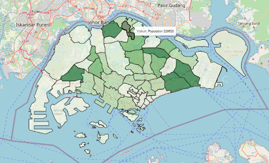
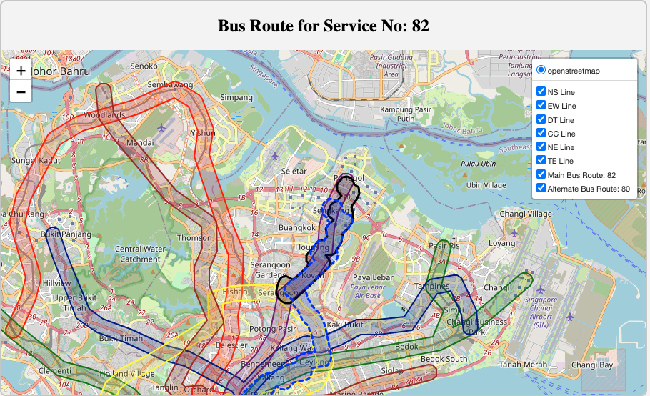

# Technical Report

## Table of Contents

[Project Setup](#project-set-up)
1. [Introduction](#1-introduction)  
   1.1 [Problem Statement](#11-problem-statement)  
   1.2 [Background](#12-background)  
   1.3 [Success Criteria](#13-success-criteria)

2. [Scope](#2-project-setup)  
   2.1 [Problem](#21-repository)  
   2.2 [Success Criteria](#22-backend-and-frontend)  
   2.3 [Assumptions]
	
3. [Methodology](#3-methodology)  
   3.1 [Technical Assumptions](#31-technical-assumptions)  
   3.2 [Data](#32-data)  
      3.2.1 [Datasets Used](#321-datasets-used)  
         3.2.1.1 [LTA DataMall](#3211-lta-datamall)  
         3.2.1.2 [OneMap API](#3212-onemap-api)  
         3.2.1.3 [Wikipedia](#3213-wikipedia)  
         3.2.1.4 [OSRM API](#3214-osrm-api)  
         3.2.1.5 [Department of Statistics](#3215-department-of-statistics)  
      3.2.2 [Data Cleaning](#322-data-cleaning)  
   3.3 [Phase One](#33-phase-one)  
      3.3.1 [Creating the Base Map](#331-creating-the-base-map)  
      3.3.2 [Processing Bus Routes](#332-processing-bus-routes)  
      3.3.3 [Processing MRT Lines](#333-processing-mrt-lines)  
      3.3.4 [Combining into One DataFrame](#334-combining-into-one-dataframe)  
      3.3.5 [Calculating MRT-BUS Parallelism (Filter 1: Overlap Percentage)](#335-calculating-mrt-bus-parallelism-filter-1-overlap-percentage)
      3.3.6 [Handling NaN Data (Filter 2)](#336-handling-nan-data-filter-2)
   3.4 [Phase Two: Consumer Sentiment](#34-phase-two-consumer-sentiment)  
      3.4.1 [Additional Feature Engineering](#341-additional-feature-engineering)  
         3.4.1.1 [Passenger Volume OD Data](#3411-passenger-volume-od-data)  
         3.4.1.2 [Bus Routes Distance](#3412-bus-routes-distance)  
         3.4.1.3 [Population Served](#3413-population-served)  
         3.4.1.4 [Bus Frequency](#3414-bus-frequency)  
         3.4.1.5 [Alternative Bus Services](#3415-alternative-bus-services)  
      3.4.2 [Plotting Functions](#342-plotting-functions)  
      3.4.3 [Creating a Scoring System](#343-creating-a-scoring-system)  

1. [Results](#4-results)  
   4.1 [Scoring System](#41-scoring-system)  
   4.2 [Proposed Changes to Bus Routes](#42-proposed-changes-to-bus-routes)  

2. [Discussion](#5-discussion)  
   5.1 [Improving Our Methodology](#51-improving-our-methodology)  
   5.2 [Limitations](#52-limitations)  
   5.3 [Future Work](#53-future-work)  

3. [Conclusion](#6-conclusion)  

---
## Project Set Up
Our main programming language is Python. We chose Python because it offers extensive library frameworks that are well-suited for our project and because we are all proficient in coding with Python.

Our project can be split into two components:
1. Data Analytics
2. Backend and Frontend
   
In this technical report, we will focus mainly on **Data Analytics**.

### Repository
Our GitHub repository can be found [here](https://github.com/DSA4264/project). Instructions to run the code can be found in our README.md.

### Backend and Frontend
This is a rough overview of our backend and frontend approach.

#### Frontend
The goal of our frontend was to build an interactive interface that allows users to input any bus data they wish to see. Styling was done within styles.css.

Our frontend was created using HTML and some JavaScript, and was split into a scrollytelling section and an interactive map function. The scrollytelling section was made using HTML, serving as a simple methodology to inform users about what they are seeing.

The second section was made using both HTML and Leaflet.js. Leaflet.js is a JavaScript framework that interfaces with Folium, which creates an interactive map where users can scroll, zoom, and control the layers.

#### Backend
The backend was implemented using Python Flask. We included two main functions:
1. Map generation
2. Bus route plotting and bus alternative suggestions

These functions were obtained and modified from main.ipynb.

---

## 1. Introduction

Obligatory reminder: The findings and opinions presented in this project are solely our own and are not affiliated with or endorsed by the National University of Singapore.

We were approached by the Land Transport Authority (LTA) to utilise their publicly available datasets to address the issue of redundant bus routes.

### 1.1 Background

In October 2023, LTA announced that it would be [discontinuing bus service 167](https://www.straitstimes.com/singapore/bus-service-167-to-be-terminated-from-dec-10), citing “falling ridership numbers due to the construction of the Thomson-East Coast Line (TEL)” as the primary reason. The announcement quickly sparked a wave of public response, with many regular commuters of bus 167 voicing their concerns and finding the move unwarranted.

In an unusual turn of events, the Singapore government later [reversed this decision](https://www.straitstimes.com/singapore/transport/lta-u-turns-on-decision-to-stop-bus-service-167-route-to-be-retained-with-30-minute-intervals), opting to retain bus service 167 with increased intervals from 10 to 30 minutes. This reversal is a rare occurrence; to the best of our knowledge, no other policy decision regarding public transport has seen such a turnaround.

The LTA’s reasoning for the initial decision was grounded in basic economic principles: observing a decline in demand for the service and recognising the limited supply of buses in Singapore, it made sense, on paper, to reduce redundancy. However, our analysis suggests that bus service 167 might not have been the ideal choice for removal. Nonetheless, as with the LTA, we see the necessity for streamlining certain routes in the future.

This incident points to a possible lack of a comprehensive data science framework within the LTA to assess and identify truly “redundant” bus routes. As a team of data science students and daily bus users, we have undertaken this project to address this gap, applying data analytics and basic clustering techniques to develop a more informed approach to route optimisation.


---

## 2. Scope

### 2.1 Problem 

The Land Transport Authority (LTA) is currently facing challenges in determining and managing redundant bus routes in Singapore’s public transportation network. With the introduction of new MRT lines, areas and routes previously served by buses can now be serviced by MRTs. This leads to a decrease in ridership on certain bus routes. As LTA continues to allocate resources to operate these underutilised routes, it results in operational inefficiencies and increased costs. However, cancelling these underutilised routes may cause customer dissatisfaction, as evidenced by the case of bus 167.

Failure to address this problem has significant financial and reputational impacts.

Financially, redundant routes compel the LTA to spend more on operating costs such as fuel and labour. By rerouting the buses, LTA could potentially reduce costs by minimising duplicated services.

Operationally, poorly rerouted routes can lead to commuter dissatisfaction, as seen in the case of bus 167. The reversal of the decision led to higher costs, tarnished LTA's image, and diminished public trust, portraying LTA as indecisive or ineffective.

Tangibly, the costs of not addressing this problem include maintaining underutilised routes and potentially conducting surveys on customer satisfaction for the current unoptimised routes.

Data science is appropriate here because spatial data and data on ridership and buses are large and complex, and data science provides a platform to analyse such data. It allows us to have a scalable and replicable framework for identifying redundant bus routes while also considering additional features so we can analyse and make adjustments based on changes in ridership patterns over time. With new MRT lines being introduced, LTA can adapt our methodology to tackle the issue of managing redundant bus services.

The main problem is as follows: Identify three redundant bus routes using data science methodology.

In reality, we cannot solve this issue using a one-step approach. We needed to break this problem down into two sub-problems:
1. Identify approximately ten bus routes for each MRT line that could be discontinued, based primarily on their overlap with MRT lines. Here, we use overlap as a proxy for redundancy, as bus services that have high parallelism with MRT lines are likely to be duplicates for that particular portion of the journey.
2. Among the identified bus routes, determine additional factors that might affect rider sentiment, and narrow down to three redundant bus routes.

### 2.2 Success Criteria

There are two main success criteria:
1. **Efficient allocation of resources**: Optimise bus services in Singapore by removing redundant bus routes and reallocating resources to other, more pressing bus services. Success here could be measured by the number of bus routes identified for rerouting and a reduction in waiting times for the more essential bus services.

2. **Consumer satisfaction**: Although hard to measure, we aim to avoid a repeat of the bus 167 incident and ensure minimal disruptions in commuters' lives. Success could be assessed by monitoring commuter feedback and satisfaction through surveys, as well as tracking commuter complaints.

### 2.3 Assumptions 

We are assuming that LRT lines do not have much influence when calculating overlap percentage between a bus service and an MRT line. This is because for certain planning areas like Punggol, LRT serves as an alternative to feeder buses to MRT stations. But, in our analysis, we would prefer to focus directly on trunk services so not including LRT is similar to how we filtered feeder buses out. 

Our second assumption is that the data retrieved from Onemap API, LTA Datamall, department of statistics and OSRM API is accurate and up to date. Without this assumption, our bus routes and MRT lines may not be accurate which affects our analysis 

Our third assumption is that passengers are rational and will choose the most time efficient route if both MRT and buses are available. This allows us to equate overlap percentage as being redundant which may not be true if passengers for instance prefer buses over MRT for other reasons such as cost.


---

## 3. Methodology

### 3.1 Technical Assumptions 

We are assuming that LTA Datamall’s Passenger Volume Origin-Destination (OD) Bus Stops data can serve as a good representation of the demand and ridership for each bus service. This is because while we are able to get the total passenger trips for every origin-destination bus stop pair, we are unable to obtain specific bus service’s passenger trip figures since there may be other bus services that also have the same origin-destination pair in its bus routes. 

Our second assumption is that the overlap percentage between a bus route and an MRT line implies they serve the same transportation needs by running in parallel. For example, a bus service may connect two MRT stations but the route is not a direct or fully parallel path. So, the bus makes several stops to serve additional neighbourhoods and subareas before reaching the MRT station. Even though in theory, this particular bus route has a high overlap percentage with the MRT line, the bus service and MRT actually serve different transportation needs. Overlap percentage might not be a true indicator of how parallelism works.  


### 3.2 Data

#### 3.2.1 Datasets Used

Before delving into the analytics, we would like to emphasise that we are using publicly available datasets, which were obtained mainly from the LTA DataMall and OneMap API.

We used our own API keys to obtain the data, and we have included our data pulling code in the `data` folder.

##### 3.2.1.1 LTA DataMall

We obtained the following data from the LTA DataMall API:
1. Bus Stops data
2. Bus Routes data
3. Bus Services data
4. Passenger Volume OD Bus Stop data
5. Geospatial shapefiles for Bus and MRT

##### 3.2.1.2 OneMap API

We obtained the following data from the OneMap API:
1. Planning Areas shapefile

##### 3.2.1.3 Wikipedia

We obtained the following data from Wikipedia:
1. MRT station names

##### 3.2.1.4 Open Source Routing Machine (OSRM) API

1. Bus routes mapping

##### 3.2.1.5 Department of Statistics

1. Population Areas by Planning Areas data

#### 3.2.2 Data Cleaning

Data cleaning was relatively straightforward, compared to most datasets found online, since the data we are using was taken from public datasets from established APIs such as OneMap API and LTA DataMall.

---

### 3.3 Phase One: Filtering Parallel Routes 

We conducted two phases of filtering. The first phase involved parallelisation filtering—among all the bus services in Singapore, we compared their routes to determine if there was a high percentage overlap with the MRT.

In the second phase, we conducted distance filtering. This was necessary because some buses are labelled as 'NaN' by LTA DataMall, making it impossible for us to determine if they are trunk or feeder services. More details are elaborated below.

#### 3.3.1 Creating the Base Map

The base plot of the map we used was created using Folium, a Python package. We then created the polygons and plots and overlaid them on our interactive map. At the end of our map creation, we output it using a Python Flask framework. We used Leaflet.js to visualise the Folium map.

#### 3.3.2 Processing Bus Routes

To map all bus routes available in Singapore, we utilised the OSRM API to plot each route segment between consecutive bus stops along the road network. This methodology involved several key steps:

1. **Data Preparation and Grouping**: We began by grouping the dataset of bus routes by each unique 'ServiceNo' (bus service number) and 'Direction'. To ensure that each route was traced in the correct sequence, the data was sorted by 'StopSequence', aligning each bus stop in the order the route follows.

2. **Retrieving Route Segments Using OSRM**: For each pair of consecutive bus stops within a route, we issued an OSRM API query to retrieve the encoded polyline representing the road network path between the stops. The OSRM API provides a polyline encoding format that captures the sequence of coordinates between stops, which we stored for further analysis.

``` bash
def get_osrm_encoded_route(start_coords, end_coords):
    osrm_url = f"http://router.project-osrm.org/route/v1/driving/{start_coords[1]},{start_coords[0]};{end_coords[1]},{end_coords[0]}?geometries=polyline"
    response = requests.get(osrm_url)
    if response.status_code == 200:
        data = response.json()
        if 'routes' in data and len(data['routes']) > 0:
            return data['routes'][0]['geometry']  ## returns encoded polyline
    return None


## creating sg map
map_of_all_bus_routes = folium.Map(location=[1.3521, 103.8198], zoom_start=12)
unique_services = bus_df_w_routes_and_coordinates['ServiceNo'].unique()[:600]


## filter for unique buses
filtered_bus_df = bus_df_w_routes_and_coordinates[bus_df_w_routes_and_coordinates['ServiceNo'].isin(unique_services)]
bus_routes_grouped = filtered_bus_df.groupby(['ServiceNo', 'Direction'])


output_data = []
line_color = 'blue'  


for (service_no, direction), group in bus_routes_grouped:
   
    group = group.sort_values(by='StopSequence') ## sort group by stopsequence
    bus_stops = list(zip(group['Latitude'], group['Longitude']))
   
    ## get subsequent roads for next busstops
    for i in range(len(bus_stops) - 1):
        start_coords = bus_stops[i]
        end_coords = bus_stops[i + 1]
       
       
        encoded_route = get_osrm_encoded_route(start_coords, end_coords) ##encoded route between busstops
        if encoded_route:
            output_data.append({
                "ServiceNo": service_no,
                "Direction": direction,
                "EncodedPolyline": encoded_route
            })
           
            decoded_route = polyline.decode(encoded_route) ## decode encoded polyline to lat long
           
            ## map decoded route on the sg map
            folium.PolyLine(decoded_route, color=line_color, weight=2.5, opacity=1,
                            popup=f"Bus {service_no} Direction {direction}").add_to(map_of_all_bus_routes)


## convert output data to df
df_encoded_polylines = pd.DataFrame(output_data)
## save to csv
df_encoded_polylines.to_csv('data/encoded_polylines_output.csv', index=False)
map_of_all_bus_routes
```

3. **Creating a Unified Bus Service Geometry Object**: The OSRM API outputs a polyline encoding for every line segment between every pair of bus stops coordinates, and `df_encoded_polylines` stores this polyline encoding for every 'ServiceNo' and for every pair of origin-destination bus stops. We decoded the polyline encoding to get a LineString geometry representation for the road network path between every pair of bus stops. To get a unified geometry object for every 'ServiceNo', we grouped by 'ServiceNo' and utilised the `shapely` library's `linemerge` to combine all the LineString geometry objects into a MultiLineString geometry object.

#### 3.3.3 Processing MRT Lines

We processed MRT geospatial data from Singapore’s LTA DataMall to create unified geometry objects for each MRT line, allowing for analysis of route parallelism with bus lines. The steps involved were:

1. **Coordinate Reference System (CRS)**: We set the data’s CRS to EPSG:3414, then transformed it to EPSG:4326 for geographic compatibility.

2. **Station Ordering and Categorisation**: Stations were grouped by MRT line and ordered to connect them accurately along each route.

3. **Centroid Representation**: Each station’s polygon(s) geometry was represented by a centroid, enabling a simplified line route. This is because there exist MRT stations with multiple Polygon objects; taking the centroids of multiple Polygons gives us a more accurate representation of where the MRT station is located.

4. **Line Creation**: We connected centroids sequentially to form a LineString for each MRT line, outlining its path.

5. **Buffering of Lines**: We then created a 400m buffer for each LineString.

6. **Union of Buffered Line and Polygons**: Each MRT line’s buffered LineString geometry and its station Polygons were merged into a single geometry object using the `shapely` library’s `unary_union` function to achieve a singular geometry object representing the MRT line.

#### 3.3.4 Combining into One DataFrame

The MRT geometries were added to `df_bus_combined_geometry` alongside bus routes geometries, enabling parallelism analysis across bus and MRT networks in Singapore.

#### 3.3.5 Calculating MRT-BUS Parallelism (Filter 1: Overlap Percentage)

Overlap Percentage serves as our main filter in deciding whether to reroute a bus, as it allows us to quantify the extent of spatial parallelism between the MRT and bus routes. This metric allows us to assess how closely each bus route aligns with MRT coverage and identify potential redundancies.

1. **Adding MRT Geometries**: Each MRT line geometry (e.g., North-South, East-West) was added as a new column in the bus route GeoDataFrame (`bus_mrt_combined_gdf`), providing a spatial reference for each line alongside the bus routes.

2. **Buffering Bus Routes**: Bus routes were buffered to account for proximity to MRT lines, creating a `buffered_bus_route_geom` column with a 400-metre buffer around each route. This provides a margin for measuring spatial overlap.

3. **Calculating Overlap**: For each bus service, we calculated the percentage overlap between the buffered bus route and each MRT line geometry. This was computed by dividing the intersection area by the total area of the buffered bus route to obtain the overlap percentage. The overlap percentage gives us an idea of the proportion of the bus route that is parallel to the MRT line within a reasonable proximity.

4. **Storing Results**: The calculated overlap percentages were stored in a new DataFrame, allowing for further analysis of how closely bus routes parallel MRT lines across Singapore’s transport network.

#### 3.3.6 Handling NaN Data (Filter 2)

We noticed that quite a sizable number of 'Category' entries are labelled as 'NaN'. This is because some of the buses are operated by another company called Tower Transit, which does not have any 'Category' labels in the LTA DataMall.

This makes our filtering especially tricky, as we are unable to fill in the appropriate labels. Initially, we removed 'NaN' entries, but this resulted in many bus services being filtered out, including many actual trunk services (false negatives). Our alternative approach was to keep the 'NaN' entries, but this resulted in many feeder services being included (false positives).

We decided to take a data science approach in labelling the data. Amongst the highly overlapped bus services, we ran a K-means clustering, clustering on the average distance travelled.

Our plot is as follows:


It is evident that the optimal K here is 3.

After clustering, we examined the buses in each cluster and their normalised average distances. We chose to drop the cluster with the shortest normalised average distances. This is because the clustering suggests that buses in the remaining clusters are more likely to be trunk services due to their longer normalised average distances. In this case, from our results, we can see that buses in clusters 1 and 2 have longer normalised average distances, so are less likely to be feeders.


---

### 3.4 Phase Two: Consumer Sentiment

#### 3.4.1 Additional Feature Engineering

To address the likelihood of negative public responses for bus routes that are flagged for service changes, here are the additional features that we engineered:

##### 3.4.1.1 Passenger Volume Origin-Destination (OD) Bus Stops Data

This feature serves as a proxy for the demand and ridership for each bus service. LTA DataMall provides monthly records (backdated up to three months) of passenger trips data between pairs of origin-destination bus stops. The granularity of the data is at the hourly, origin-destination, day-type level and is stored as `jul24_od_volume`, `aug24_od_volume`, `sep24_od_volume`.

We grouped by day-type and origin-destination and summed the total passenger trips made in the month for every origin-destination pair of bus stops for weekdays and weekends/public holidays. This is stored under `jul24_aggregated_od_volume_df`, `aug24_aggregated_od_volume_df`, `sep24_aggregated_od_volume_df`.

Thereafter, we utilised the `bus_routes_df`, which contains data on the direction and sequence of bus stops that every bus service goes through. We grouped the `bus_routes_df` by its 'ServiceNo', 'Direction', and 'StopSequence' and iterated through it, storing data on the passenger trips made in the month for every origin-destination pair of bus stops and for weekdays and weekends/public holidays.

Finally, we performed a final aggregation that summed the passenger trips for every origin-destination pair of bus stops in each bus service to get the total passenger volume that the bus service receives for the month.

##### 3.4.1.2 Bus Routes Distance

In our analysis, we aimed to focus on trunk services. Although the LTA DataMall includes data on whether a bus is classified as a trunk service, this information is incomplete—some services, particularly those operated by Tower Transit, are missing this classification (e.g., service 82). Since removing these buses could exclude routes with a high overlap percentage, we decided to use the average distance travelled by the bus service as a feature to distinguish between trunk and feeder bus services. This is because feeder services generally travel shorter distances.

The `bus_routes_df` contains data on the distance travelled by the bus service from its starting location to its current 'StopSequence' for each 'Direction' under the 'Distance' column. We obtained the distance travelled by the bus service in a particular 'Direction' by grouping by 'ServiceNo' and 'Direction' and taking the maximum of the 'Distance' column.

Since there exists a mixture of bus services that have two directions or one direction, we decided that taking the average of the distance travelled by the bus service across both 'Direction' (if there exists a second direction) would be a more informative feature to distinguish between trunk and feeder bus services.

##### 3.4.1.3 Population Served

Population served gives us a rough idea of the number of people each bus service is serving. This allows us to get a rough estimate of how many commuters are being served by this bus service, adding a layer of demographic insight to the demand for each bus service.

To estimate this, we first obtained the population figures for each planning area from the Department of Statistics. Secondly, we drew out the boundary for each planning area on the Singapore map. The data for the planning area boundary was obtained from the OneMap API. Lastly, using the geometry objects of bus routes that we had previously processed, we mapped out each bus route on the Singapore map. The population served is calculated by summing up the total population for each planning area the bus service traverses through.

For example, using bus 859 as an example, the total population served for bus 859 would be the sum of the population in Yishun (229,520) and in Sembawang (110,090), as the bus traverses through these two planning areas.



##### 3.4.1.4 Bus Frequency

The intention of using bus frequency as a feature is to enable us to identify bus services that are operating less frequently. This is because commuters are less likely to react negatively to the removal of bus services that operate on a low-frequency basis.

We obtained bus frequency data using the LTA DataMall API. Since the frequency range was given in a string format and as a range, e.g., `6-10 mins`, we had to format it to an integer format to calculate an average frequency time. So for this case, the estimated time would have been 8 minutes.

##### 3.4.1.5 Alternative Bus Services

By leveraging the `buffered_bus_route_geom` column with a 400-metre buffer around each route, we have a margin for measuring spatial overlap, and we compared each bus service with all other bus services and sorted them by overlap percentage to find the top alternative bus services for each bus service. This has added an additional dimension to our analysis with the inclusion of alternative bus services that are pivotal aspects of our transport network.

#### 3.4.2 Plotting Functions

To facilitate our data analysis, frontend development, and debugging, we wrote helper functions that plot geospatial geometries for visualisation.

- **`plot_mrt_combined_geometry`**: Takes in a GeoPandas DataFrame that contains a single row of data containing information about the MRT line and the geometry representing the MRT line.

  The intention of this function is to visualise the final geometry representing the MRT line to see if the geometry manipulations to combine the MRT station polygons and the buffering of the line segments connecting MRT stations are according to our experimental design.

  It was through this function that we realised we had initially processed the MRT geometries incorrectly, which led to an underestimation of the overlap percentage between bus services and MRT lines.

```

```

- **`plot_bus_service_and_mrt_routes` (Backend version)**: Takes in a bus service number and a GeoPandas DataFrame containing information about the geometries of MRT lines as well as the geometry of each bus route.

  The function then plots the bus route of the selected bus service number as lines, while the MRT lines are represented as geometries.

  The purpose of this plotting function is to sense-check the accuracy of the bus routes generated using the OSRM API since the bus routes are now unbuffered.


- **`modified_plot_bus_service_and_mrt_routes`**: Takes in a bus service number and a GeoPandas DataFrame containing information about the geometries of MRT lines as well as the buffered geometry of each bus route.

  The function then plots the bus route of the selected bus service number as geometries, while the MRT lines are represented as geometries.

  The purpose of this plotting function is to sense-check our overlap percentage calculations.

``` bash
def modified_plot_bus_service_and_mrt_routes(service_no, gdf):


   # Filter the row with the given service number
   row = gdf[gdf['ServiceNo'] == service_no]


   if row.empty:
       print(f"No data found for ServiceNo: {service_no}")
       return None


   # Extract the buffered bus route geometry
   bus_route = row.iloc[0]['buffered_bus_route_geom']


   # Extract the MRT line geometries
   mrt_geoms = [
       row.iloc[0]['NS_MRT_geom'],
       row.iloc[0]['EW_MRT_geom'],
       row.iloc[0]['DT_MRT_geom'],
       row.iloc[0]['CC_MRT_geom'],
       row.iloc[0]['NE_MRT_geom'],
       row.iloc[0]['TE_MRT_geom']
   ]


   # Corresponding MRT line colors
   colors = [
       'red',         # NS Line
       'green',       # EW Line
       'darkblue',    # DT Line
       'yellow',      # CC Line
       'purple',      # NE Line
       'brown'        # TE Line
   ]


   # Center the map on the first point of the buffered bus route or MRT geometry
   start_coords = [bus_route.centroid.y, bus_route.centroid.x]  # lat, lon


   # Create a Folium map centered on the bus route
   m = folium.Map(location=start_coords, zoom_start=13)


   # Plot the buffered bus route in black
   folium.GeoJson(
       bus_route,
       name='Buffered Bus Route',
       style_function=lambda x: {'color': 'black', 'weight': 2, 'fillOpacity': 0.3}
   ).add_to(m)


   # Plot each MRT line geometry with the corresponding color
   for mrt_geom, color, name in zip(mrt_geoms, colors, [
       'NS Line', 'EW Line', 'DT Line', 'CC Line', 'NE Line', 'TE Line'
   ]):
       folium.GeoJson(
           mrt_geom,
           name=name,
           style_function=lambda x, color=color: {'color': color, 'weight': 2}
       ).add_to(m)


   # Add a layer control to switch between routes
   folium.LayerControl().add_to(m)


   # Return the map object
   return m

```

- **`plot_bus_service_and_mrt_routes` (Frontend version)**: This function builds upon the existing `modified_plot_bus_service_and_mrt_routes` function and allows for the inclusion of alternative bus services. This allows us to visualise the overlaps between a selected bus service and its closest bus alternative, providing a clear visual representation of the alternative transport options for a bus service.

``` bash
def plot_bus_service_and_mrt_routes(service_no, gdf, alternative_service_no=None):
   # Initialise the map centered on Singapore
   singapore_coords = [1.3521, 103.8198]
   m = folium.Map(location=singapore_coords, zoom_start=12, control_scale=True)


   # Plot MRT lines
   line_colors = {
       'NS Line': 'red',
       'EW Line': 'green',
       'DT Line': 'darkblue',
       'CC Line': 'yellow',
       'NE Line': 'purple',
       'TE Line': 'brown'
   }


   for line_name, color in line_colors.items():
       geom_col = f"{line_name.split()[0]}_MRT_geom"
       mrt_geom = gdf.iloc[0][geom_col]
       if mrt_geom and not mrt_geom.is_empty:
           folium.GeoJson(
               mrt_geom,
               name=line_name,
               style_function=lambda x, color=color: {'color': color, 'weight': 2}
           ).add_to(m)


   # Plot main bus route
   if service_no:
       row = gdf[gdf['ServiceNo'] == service_no]
       if not row.empty:
           bus_route = row.iloc[0]['geometry']
           if bus_route and not bus_route.is_empty:
               # Center the map on the bus route
               m.location = [bus_route.centroid.y, bus_route.centroid.x]
               m.zoom_start = 13
               route_name = f"Main Bus Route: {service_no}"
               main_bus_route_fg = folium.FeatureGroup(name=route_name, overlay=True, control=True)
               folium.GeoJson(
                   bus_route,
                   name=route_name,
                   style_function=lambda x: {'color': 'black', 'weight': 3}
               ).add_to(main_bus_route_fg)
               main_bus_route_fg.add_to(m)
       else:
           print(f"No data found for ServiceNo: {service_no}")


   # Plot alternative bus route
   if alternative_service_no:
       alt_row = gdf[gdf['ServiceNo'] == alternative_service_no]
       if not alt_row.empty:
           alt_bus_route = alt_row.iloc[0]['geometry']
           if alt_bus_route and not alt_bus_route.is_empty:
               alt_route_name = f"Alternate Bus Route: {alternative_service_no}"
               alternative_bus_route_fg = folium.FeatureGroup(name=alt_route_name, overlay=True, control=True)
               folium.GeoJson(
                   alt_bus_route,
                   name=alt_route_name,
                   style_function=lambda x: {'color': 'blue', 'weight': 3, 'dashArray': '5, 5'}
               ).add_to(alternative_bus_route_fg)
               alternative_bus_route_fg.add_to(m)
       else:
           print(f"No data found for Alternative ServiceNo: {alternative_service_no}")


   # Add Layer Control
   folium.LayerControl(collapsed=False).add_to(m)


   return m._repr_html_()

```
#### 3.4.3 Creating a Scoring System

Now our final DataFrame contains the following information:
1. Overlap percentage with respect to each MRT line (`OverlapPercentage`)
2. Average overlap percentage of top 5 overlapping buses (`Avg_Bus_Overlap_Percentage`)
3. Overlap percentage of the top overlapping bus (`Max_Bus_Overlap_Percentage`)
4. Population number served (`Population_Served`)
5. Estimated passenger OD data (`Average_Passenger_Volume`)
6. Mean bus frequency (`Mean_Freq`)

We are able to generate a scoring system based on this to determine the usefulness of the bus services.

---

## 4. Results

### 4.1 Scoring System

Based on our scoring system, the higher the score, the more suitable a bus service is for rerouting or removal.

As larger values in `Average_Passenger_Volume` and `Population_Served` suggest that these bus services are likely to be popular and in demand, we have chosen to invert them for our scoring system so that bus services that are less popular receive higher scores.

We have also opted for a `MinMaxScaler` with a feature range of 0 to 1 as our features have very different ranges. By scaling to a common range, we are able to compare different features directly and combine them for a total score.

- A higher `OverlapPercentage` suggests that the bus service overlaps more with the MRT line, indicating that the MRT line would be a strong alternative to the bus service.
- A higher `Avg_Bus_Overlap_Percentage` and `Max_Bus_Overlap_Percentage` suggest that there are more alternative bus services overlapping and there are closely overlapping bus services available. Hence, commuters can depend on alternative bus services after the removal of the bus service.
- We have inverted the `Average_Passenger_Volume` to give higher scores for bus services with low commuter demand.
- A higher `Mean_Freq` score means that the bus arrives infrequently and commuters are less likely to depend on the service for their travels.
- We have also inverted the `Population_Served` to give higher scores for bus services that pass through areas with low populations, as it implies lower potential demand for the bus service and fewer people would be affected by its removal.

**Final Score**: For the final score, we added the values of all features while halving the values of `Avg_Bus_Overlap_Percentage` and `Max_Bus_Overlap_Percentage` to ensure that bus services are not given excessive weight in the final scoring. The top-scoring bus services are then selected for further analysis.

### 4.2 Proposed Changes to Bus Routes

#### Bus Service 400


Bus Service 400 mainly serves the Central Business District (CBD) area. It overlaps significantly with the Thomson-East Coast Line (TEL), with stations Shenton Way (TE19), Marina Bay (TE20), and Gardens by the Bay (TE22) being covered in the route. This has resulted in low demand for this bus service, with the lowest average passenger volume and population served. The presence of several MRT lines in the area, availability of alternative bus routes, and low frequency of the bus (30 minutes) mean that it would be unlikely to cause public outrage with its removal.

#### Bus Service 36B


Bus Service 36B is a 30 km short trunk variant of Bus Service 36. With significant overlaps with the Thomson-East Coast Line (TEL), we propose amending the service to terminate at Tanjong Katong (TE25) to leverage the recent launch of Thomson-East Coast Line Stage 4 (TEL4). This would avoid overlapping additional TEL stations: Marine Parade (TE26), Marine Terrace (TE27), and Siglap (TE28), and allow the service to focus on alleviating demand in the city areas of Suntec City, City Hall, Dhoby Ghaut, and Orchard.

#### Bus Service 883


Bus 883 is a trunk service plying between Sembawang and Yishun Central 2. It overlaps significantly with the North-South Line (NSL), covering the stations of Sembawang (NS11), Canberra (NS12), and Yishun (NS13). With the launch of Canberra station in 2019, residents of Canberra no longer have to depend on this service for connectivity to MRT stations, and the presence of a strong alternative, bus 117, would likely be able to cope effectively with commuter demand.

#### Bus Service 82



Bus Service 82 is a trunk service plying through Punggol and looping at Serangoon Central, passing through Sengkang, Hougang, and Kovan. It largely duplicates the North-East Line (NEL) and has strong bus alternatives such as Bus 80, which overlaps with significant portions of its route. With its total travelling time of 85 minutes, it would take more than 40 minutes to travel from Punggol to Serangoon. This is likely to be easily substituted by the existing NEL as well as alternative buses like Bus 80, which covers the areas from Serangoon to Sengkang.

---

## 5. Discussion

### 5.1 Improving Our Methodology

Before our current approach, we explored a one-size-fits-all clustering approach to identify bus services for rerouting or removal using features like overlap percentage between MRT lines and services, and passenger volume origin-destination bus stops.

However, we realised that this approach might have been overly ambitious since the primary consideration should still first be identifying trunk bus services that have a high degree of parallelism with MRT lines. Therefore, instead of applying a broad clustering approach, we refined our strategy to focus initially on identifying these trunk services with a high degree of parallelism with MRT lines.

This more targeted approach allows us to build a data-driven foundation that can later incorporate additional factors that can assess the likelihood of a negative public response for bus routes that are flagged for service changes, such as the existence of alternative bus services, but starts with addressing the primary issue of overlapping routes with MRT lines.

### 5.2 Limitations

#### Lack of Usable Data

The data provided by LTA were relatively clean but did not provide deeper insights. For instance, we needed to gather the passenger volume data for each bus route but were unable to get granular data. We had to improvise and use passenger OD data, but we concluded that it was just an estimate. Having the granular values would have enhanced our analytics.

#### Accuracy of Routes

By using the OSRM API to plot each bus route segment between consecutive bus stops, we had to assume that each bus service was taking the shortest path between each consecutive bus stop. This assumption did not hold all the time, especially for feeder services looping through a neighbourhood. Nevertheless, this assumption holds generally for trunk services that tend to travel longer distances and take the shortest paths between bus stops.

#### Potential Under-representation of Workplaces

As the population served metric is calculated by residential populations in each planning area, this means that residential areas are prioritised in our scoring system. This could explain why bus service 400 received the highest score for `Population_Served` as it mostly operated within the Central Business District, which has a small residential population. Hence, having more information on the density of commuters in workplaces and commercial sites could potentially provide additional insights.

### 5.3 Future Work

With the continued development of new MRT lines in Singapore's transport system, there will be a need to look at bus services serving areas where new MRT stations are available. With a longer timeframe, it would also be possible to track passenger data for bus services over a longer period, thereby allowing for analysis of the changes in demand for each bus service.

We are confident in the product we have developed and can ensure that it will be future-proof to the addition of new bus routes and MRT lines. We originally intended for this to be a full frontend website to use and share our findings. However, the tight timeframe only allowed us to create a simple interactive map. Given the opportunity, we would like to revisit this project in the future to create an interactive graphic for the public to learn from.

---

## 6. Conclusion

In this project, we have developed a data-driven methodology to identify redundant bus routes in Singapore's public transportation network. By analysing spatial overlaps between bus routes and MRT lines, and incorporating additional features such as passenger volumes, population served, bus frequencies, and alternative services, we have proposed specific bus routes for rerouting or removal. Our approach aims to optimise resource allocation while minimising commuter dissatisfaction.

While there are limitations due to data availability and assumptions made, our framework provides a scalable and adaptable solution that can be refined with more granular data and extended to future transportation developments. We believe that such data science methodologies can greatly assist the LTA in making informed decisions that balance efficiency with public interest.

---


